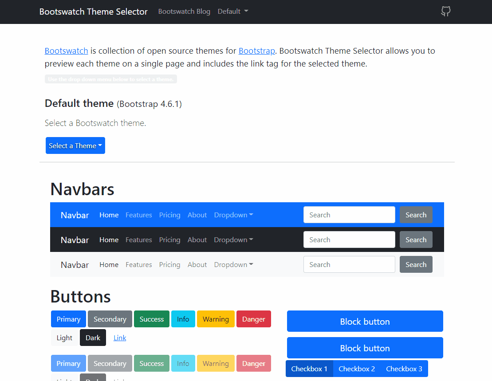

# Bootswatch Theme Selector

[](/LICENSE)


Bootswatch Theme Selector is a front end React application that uses the [Bootswatch API](https://bootswatch.com/help/#api) to retrieve a current list of Bootswatch themes and allows the user to see the styling of any of these themes applied on a single page. The data returned from the API is used to populate the select dropdown menu, theme description, and updates the page's CSS link tag to apply the selected theme. The Bootswatch CDN link tag is displayed on the screen for the selected theme. 

 [Bootswatch](https://bootswatch.com/) is collection of open source themes for [Bootstrap](https://getbootstrap.com/). Bootswatch Theme Selector allows you to preview each theme on a single page and includes the link tag for the selected theme.

- [Getting Started](#environment_setup)
- [Start the Application](#start)
- [Website](#website)
- [Built with](#tech_stack)
- [Contributing](#contributing)
- [Github Link](#github_link)

---



---


##  Getting Started <a name = "environment_setup"></a>

To run this application in your own development environment, install [NodeJs](https://nodejs.org/en/about/) and [Git](https://git-scm.com/book/en/v2/Getting-Started-Installing-Git), and a text editor of your choice.


----
## Start the Application  <a name = "start"></a>

 Install all node package dependencies listed in the package.json file using the following command in your terminal, in the directory of the project:

```
npm install
```

After all packages have been installed, you can run a development version of the application in your web browser on localhost using this command:

```
npm start
```

## Website <a name = "Website"></a>

View project demo here: &nbsp;
https://adamlane.dev/bootswatch-theme-selector/  

##  Technologies Used  <a name = "tech_stack"></a>
- [NodeJS](https://nodejs.org/) -  JavaScript runtime
- [ReactJS](https://reactjs.org/) - JavaScript UI library
- [Axios](https://axios-http.com/docs/api_intro) - Promise based HTTP client

----------------
##  Contributing <a name = "contributing"></a>

Open source contributions are always welcome. Submit a pull request or an issue if you would like to contribute or request improvements.

---------------

<br/>

## Github Link <a name = "#github_link"> </a>
This is helpful if the repository has been downloaded:
 https://github.com/alane019/bootswatch-theme-selector
