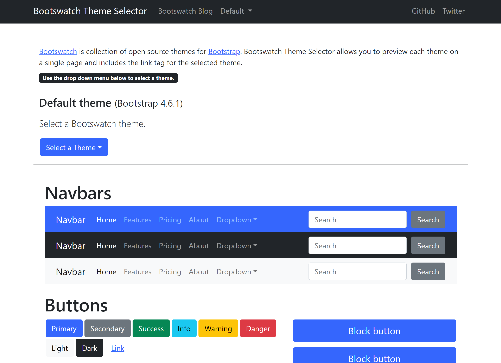

# Bootswatch Theme Selector

[](/LICENSE)

<!-- <b> Website: </b> &nbsp;  https://alane019.github.io/bootswatch-theme-selector -->


## Table of Contents


- [Getting Started](#environment_setup)
- [Start the Application](#start)
- [Website](#website)
- [Built Using](#tech_stack)
- [Contributing](#contributing)

---




##  Getting Started <a name = "environment_setup"></a>

To run this application in your own development environment, install [NodeJs](https://nodejs.org/en/about/) and [Git](https://git-scm.com/book/en/v2/Getting-Started-Installing-Git), and a text editor of your choice.


----
## Start the Application  <a name = "start"></a>

 Install all node package dependencies listed in the package.json file using the following command in your terminal, in the directory of the project:

```
npm install
```
You can also use:

```
npm i
```
After all packages have been installed, you can run a development version of the application in your web browser on localhost using this command:

```
npm start
```

## Website <a name = "Website"></a>

<!-- Github pages: &nbsp;
https://alane019.github.io/bootswatch-theme-selector  -->

##  Technologies Used  <a name = "tech_stack"></a>
- [NodeJS](https://nodejs.org/) -  JavaScript runtime
- [ReactJS](https://reactjs.org/) - JavaScript UI library
- [Axios](https://axios-http.com/docs/api_intro) - Promise based HTTP client

----
##  Contributing <a name = "contributing"></a>

Open source contributions are always welcome. Submit a pull request or an issue if you would like to contribute or request improvements.

---------------

<b> Github link: </b> &nbsp;  https://github.com/alane019/bootswatch-theme-selector
